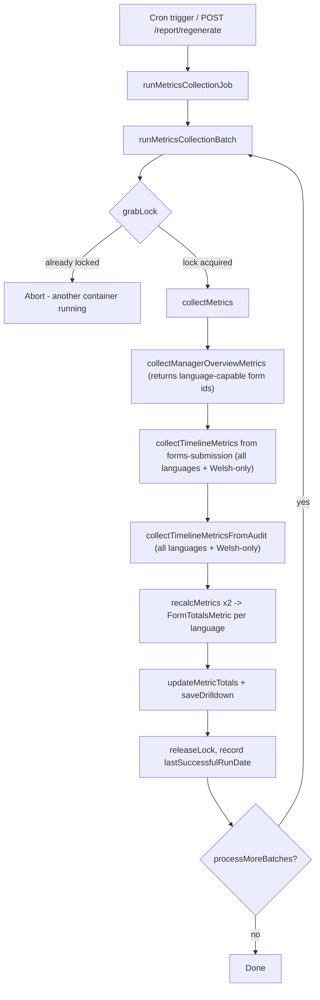
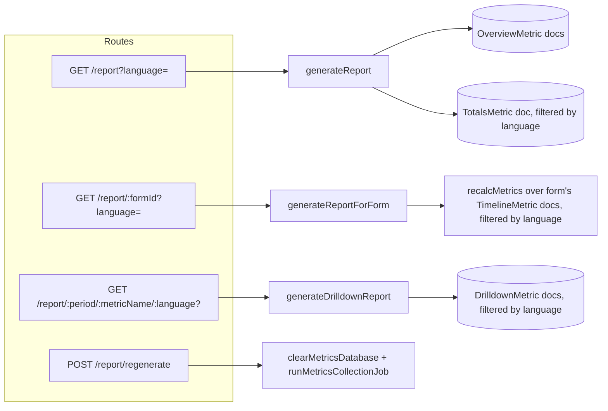

# Metrics Reporting (`/report`)

This document explains how the forms-audit-api collects, stores and serves form metrics, and how the `/report` family of endpoints turns raw data into the dashboard tiles and drilldowns.

## Overview

Metrics answer questions like "how many forms were created in the last 7 days?", "how long does it take to publish a form?" and "how many submissions has form X had?". The system is split into two concerns:

1. **Collection** – a scheduled job (`metrics-job.js` / `cron.js`) pulls data from `forms-manager`, `forms-submission` and this service's own audit event collection, then aggregates it into rolling time-window totals.
2. **Reporting** – the `/report*` routes read the pre-aggregated data back out, with no heavy computation at request time (`generateReport`, `generateReportForForm`, `generateDrilldownReport`).

All metric documents live in a single Mongo collection (see [`METRICS_COLLECTION_NAME`](../src/mongo.js)), distinguished by a `type` discriminator field.

Every collection pass also runs a second, **Welsh-only** pass alongside the "all languages" pass (see [`CY`](../src/constants.js)), so timeline, totals and drilldown records exist in two variants: one with no `language` field (all submissions/forms) and one with `language: 'cy'` (Welsh submissions/forms only). Reporting endpoints accept an optional `language` parameter to pick which variant to read back.

## Data structures

All types are stored as plain documents in the metrics collection, and are typed via `@defra/forms-model` (`FormMetricName`, `FormMetricType`, `FormStatus`). The `type` field determines which "shape" a document has:

| `type` (`FormMetricType`)                                | Purpose                                                                                                                                                | Written by                                   | Read by                                                                    |
| -------------------------------------------------------- | ------------------------------------------------------------------------------------------------------------------------------------------------------ | -------------------------------------------- | -------------------------------------------------------------------------- |
| `OverviewMetric`                                         | One snapshot document per form/status (draft or live) describing the form's current state (name, org, language, submission count)                      | `saveFormOverviewMetrics`                    | `getAllOverviewMetrics` → `generateReport`                                 |
| `TimelineMetric`                                         | An immutable event record: "this happened, at this time, for this form" (e.g. a submission, a publish, a form created)                                 | `saveFormTimelineMetrics`                    | `getAllTimelineMetrics` / `getFormTimelineMetricsCursor` → `recalcMetrics` |
| `TotalsMetric`                                           | A pre-computed rollup document covering all the time windows (last 7 days, last 30 days, etc.) - one per language variant (all languages + Welsh-only) | `updateMetricTotals`                         | `getMetricTotals` → `generateReport` / `generateReportForForm`             |
| `DrilldownMetric`                                        | The individual `TimelineMetric` records that make up a tile's count, saved separately so the totals document stays small                               | `saveDrilldownRecords` (via `saveDrilldown`) | `getDrilldownRecords` → `generateDrilldownReport`                          |
| `form-metric-control` (constant, not a `FormMetricType`) | Singleton lock/checkpoint record used to serialize the job across multiple containers and remember where collection left off                           | `grabLock` / `releaseLock`                   | `runMetricsCollectionBatch`                                                |

### `FormOverviewMetric`

One per `(formId, formStatus)` pair, replaced wholesale on every collection run:

```js
{
  type: 'OverviewMetric',
  formId: 'abc123',
  formStatus: 'live' | 'draft',
  language: 'cy',       // present only if the form supports/was submitted in Welsh; drives language filtering
  summaryMetrics: { name, organisation, teamName, /* + daysToPublish, republished added at read time */ },
  featureMetrics: { /* e.g. welsh translation, email confirmation flags */ }
}
```

### `FormTimelineMetric`

One per discrete event. `metricName` is one of the `FormMetricName` values, each with a fixed **calculation type** defined in [`metricConfig`](../src/service/metrics-helper.js):

| `FormMetricName`      | Calculation type          | Meaning                                                                                                                |
| --------------------- | ------------------------- | ---------------------------------------------------------------------------------------------------------------------- |
| `NewFormsCreated`     | AccumulationWithDrilldown | Count of forms created in the window, drilldown available                                                              |
| `FormsFirstPublished` | AccumulationWithDrilldown | Count of first-time publishes                                                                                          |
| `FormsRePublished`    | AccumulationWithDrilldown | Count of subsequent republishes                                                                                        |
| `Submissions`         | AccumulationWithDrilldown | Count of form submissions (live only counts toward windowed totals; draft submissions are tracked separately per-form) |
| `FormsInDraft`        | Snapshot                  | Point-in-time count of forms currently in draft with no live version                                                   |
| `TimeToPublish`       | Average                   | Days between first draft and first publish, averaged across forms in the window                                        |

```js
{
  type: 'TimelineMetric',
  formId: 'abc123',
  formStatus: 'live' | 'draft',
  metricName: 'submissions' | 'formsFirstPublished' | ...,
  metricValue: 1,       // or a day-count for TimeToPublish, or a running count for FormsInDraft
  createdAt: Date,
  language: 'cy'         // only present on records collected during the Welsh-only pass
}
```

### `FormTotalsMetric`

The rollup document - one is stored per language variant (no `language` field for the all-languages totals, `language: 'cy'` for the Welsh-only totals). Each time-window key holds a map of `metricName → { count }` (or `{ count, details }` for drilldown-enabled metrics before they're stripped out and persisted separately):

```js
{
  type: 'TotalsMetric',
  language: 'cy',       // omitted for the all-languages totals document
  last7Days:  { newFormsCreated: { count }, submissions: { count }, formsInDraft: { count }, timeToPublish: { count }, ... },
  prev7Days:  { ... },
  last30Days: { ... },
  prev30Days: { ... },
  lastYear:   { ... },
  prevYear:   { ... },
  allTime:    { ... },
  // per-form maps, not time-windowed
  liveSubmissions:  { formId: totalCount },
  draftSubmissions: { formId: totalCount },
  daysToPublish:    { formId: days },
  republished:      { formId: count },
  earliestDate: Date,   // earliest submission ever seen (fallback if none)
  updatedAt: Date
}
```

### `FormDrilldownMetric`

The raw contributing records behind an `AccumulationWithDrilldown` tile, saved with enough context to look them back up:

```js
{
  type: 'DrilldownMetric',
  periodName: 'last7Days' | 'last30Days' | 'allTime',
  metricName: 'submissions' | ...,
  formId, metricValue, createdAt,
  language: 'cy'   // carried over from the parent totals document, if present
}
```

Only `last7Days`, `last30Days` and `allTime` are exposed for drilldown (see `metricDrilldownPeriods`); the other windows (`prev7Days`, `prev30Days`, `lastYear`, `prevYear`) are used for trend comparisons only.

### Control record (`form-metric-control`)

A singleton document that prevents two containers running the job concurrently and records where the last successful run got to:

```js
{
  type: 'form-metric-control',
  locked: boolean,
  jobStart: Date,
  jobEnd: Date | null,
  lastSuccessfulRunDate: Date | null,
  lastRunResult: string,
  updatedAt: Date
}
```

## Gathering process (collection)

Collection is triggered by a cron schedule (`config.metricsCrontab`, registered in [`cron.js`](../src/plugins/cron.js)) or manually via `POST /report/regenerate`. Both call `runMetricsCollectionJob` in [`metrics-job.js`](../src/service/metrics-job.js).



1. **Locking** – `grabLock` atomically flips the control record to `locked: true` so only one container processes a batch at a time; if already locked, the job silently exits.
2. **Batching** – `collectMetrics` figures out the date range to process: from `lastSuccessfulRunDate + 1 day` up to yesterday, capped at `MAX_DAYS_PER_BATCH` (30) days per batch. This lets a first-ever run backfill history (from a fixed `EARLIEST_REPORT_DATE_AS_STRING` of `2025-07-01`) in manageable chunks, running `runMetricsCollectionBatch` repeatedly (`processMoreBatches`) until caught up.
3. **Overview metrics** (`collectManagerOverviewMetrics`) – calls `forms-manager`'s `/report/overview` endpoint page by page (20 forms/page, to keep each call fast), deletes all existing `OverviewMetric` documents, and re-saves fresh draft/live snapshots per form. While paging through, it also builds and returns `languageCapableForms` – `{ draftIds, liveIds }` sets of form IDs whose draft/live `summaryMetrics` show a `language` (e.g. Welsh) – used to scope the Welsh-only audit pass below.
4. **Timeline metrics from submissions** (`collectTimelineMetrics`) – for each day in the batch, calls `forms-submission`'s `/report/timeline?date=...` endpoint and stores each returned entry as a `TimelineMetric`. This runs **twice per day**: once with no `language` param (all languages) and once with `language=cy` (Welsh-only); Welsh-only records are tagged with `language: 'cy'` before being saved.
5. **Timeline metrics from audit events** (`collectTimelineMetricsFromAudit`) – derives additional timeline metrics directly from this service's own audit trail for the same day, also run twice per day (all languages, then Welsh-only using `languageFormIds` to restrict the audit query to language-capable forms):

- `FORM_CREATED` audit events → `NewFormsCreated` metric, and increments a running "forms currently in draft" counter (seeded from yesterday's `FormsInDraft` value for that language via `getNumberOfFormsInDraft`).
- `FORM_LIVE_CREATED_FROM_DRAFT` audit events → either `FormsFirstPublished` (+ `TimeToPublish`, calculated from the form's first `NewFormsCreated` record) on first publish, or `FormsRePublished` on subsequent publishes; first publishes decrement the "forms in draft" counter. On the Welsh-only pass, first-publish/first-draft lookups are skipped unless the form is in `languageFormIds`.
- The resulting draft count is stored as a `FormsInDraft` snapshot metric for that day, tagged with `language` where applicable.

6. **Recalculation** (`recalcMetrics`) – run once per language (all languages, then Welsh-only) once all days in the batch are stored as `TimelineMetric` documents. It walks every timeline metric matching that language (via a Mongo cursor) and buckets it into fixed windows relative to the report date: `last7Days`, `prev7Days`, `last30Days`, `prev30Days`, `lastYear`, `prevYear`, `allTime`. For each window, `handleMetricValue` applies the metric's calculation type:

- **Accumulation / AccumulationWithDrilldown** – running sum (`updateMetricTotal`); drilldown-enabled metrics also keep a `details` array of the minimal contributing records.
- **Snapshot** – last value wins (`setMetricTotal`), used for `FormsInDraft`. Since the cursor can return `FormsInDraft` records for other languages too, non-matching-language records are skipped explicitly before applying the calc type.
- **Average** – running total + count (`updateMetricAverage`), divided down to an average by `calcAverages` at the end.

It also builds per-form maps outside the time windows: total live/draft submissions per form, days-to-publish per form, and republish counts per form — these back the per-row columns in the overview table rather than the summary tiles. The resulting totals document is tagged with `language` if one was supplied. 7. **Persistence** (`updateMetricTotals`) – now takes an array of totals (one per language) and replaces all `TotalsMetric` and `DrilldownMetric` documents transactionally: existing totals/drilldown records are deleted, then for each language's totals, `saveDrilldown` extracts and stores each tile's `details` array as separate `DrilldownMetric` documents (tagged with the same `language`, to keep the totals document small), then the stripped-down totals are saved as their own `TotalsMetric` document. 8. **Unlocking** (`releaseLock`) – always runs (`finally`), records success/failure message and, on success, advances `lastSuccessfulRunDate` to the batch's end date so the next run resumes from there.

All of collection runs inside a single Mongo `ClientSession`/transaction per batch (`session.withTransaction`), so a failed batch leaves previously-committed data untouched.

## Reporting process (`/report` routes)

Defined in [`routes/report.js`](../src/routes/report.js). These routes only read pre-computed data — no aggregation happens on request.



### `GET /report`

Handled by `generateReport(filter)`:

- Fetches all `OverviewMetric` documents via `getAllOverviewMetrics`, optionally filtered by `searchText` (form name, case-insensitive regex), `status` (draft/live), `org` and `language` (all via query params validated by Joi; `language` may only be `cy`, replacing the earlier `features` filter).
- Fetches the `TotalsMetric` document for that `language` via `getMetricTotals(filter.language, session)`.
- Calls `applyExtraColumns` to merge in `submissionsCount`, `daysToPublish` and `republished` (looked up per-form from the totals' per-form maps) into each overview row.
- Returns `{ overview: [...], totals: {...} }` — `overview` drives the per-form table, `totals` drives the summary tiles.

### `GET /report/{formId}`

Handled by `generateReportForForm(formId, language)` (`language` is an optional query param):

- Instead of reading pre-aggregated totals, it re-runs `recalcMetrics` scoped to just that form's `TimelineMetric` documents for the given `language` (via `getFormTimelineMetricsCursor`), as of "yesterday", giving per-form windowed totals on demand.
- Adds `earliestDate`/`updatedAt` from the matching-language `TotalsMetric` document so the UI can show the overall reporting date range.
- Returns `{ totals: {...} }`.

### `GET /report/{period}/{metricName}/{language?}`

Handled by `generateDrilldownReport(period, metricName, language)` (`language` is now an optional path segment rather than a query param):

- `period` must be one of `last7Days`, `last30Days`, `allTime` (the only periods drilldown was retained for); `metricName` must be a valid `FormMetricName`; `language`, if given, must be `cy`.
- Reads matching `DrilldownMetric` documents via `getDrilldownRecords` (filtered by `language`) and returns `{ drilldownRows: [...] }` — the list of individual events that make up a summary tile, for the "click a tile to see details" UI.

### `POST /report/regenerate`

Admin-only (requires the `DeadLetterQueues` scope). Wipes all metrics data (`clearMetricsDatabase`, everything except the control record) and kicks off `runMetricsCollectionJob` **without awaiting it** ("fire-and-forget") so the HTTP request doesn't time out while the (potentially multi-batch, historical) job runs in the background.

## Key files

| File                                                                                            | Responsibility                                                            |
| ----------------------------------------------------------------------------------------------- | ------------------------------------------------------------------------- |
| [`src/routes/report.js`](../src/routes/report.js)                                               | HTTP routes, request validation                                           |
| [`src/service/metrics.js`](../src/service/metrics.js)                                           | Core collection + reporting logic                                         |
| [`src/service/metrics-helper.js`](../src/service/metrics-helper.js)                             | Metric calculation-type config, date helpers                              |
| [`src/service/metrics-job.js`](../src/service/metrics-job.js)                                   | Job orchestration, locking, batching loop                                 |
| [`src/plugins/cron.js`](../src/plugins/cron.js)                                                 | Schedules the job via `node-cron`                                         |
| [`src/repositories/metrics-repository.js`](../src/repositories/metrics-repository.js)           | All Mongo reads/writes for metric documents                               |
| [`src/repositories/audit-record-repository.js`](../src/repositories/audit-record-repository.js) | Supplies audit-derived timeline metrics                                   |
| [`src/constants.js`](../src/constants.js)                                                       | Defines the `CY` (Welsh) language code used throughout language filtering |
